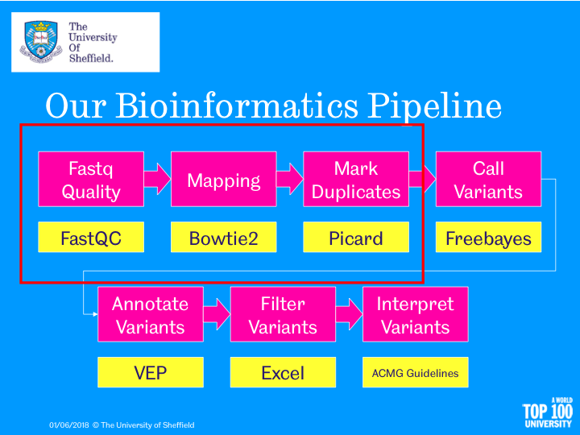
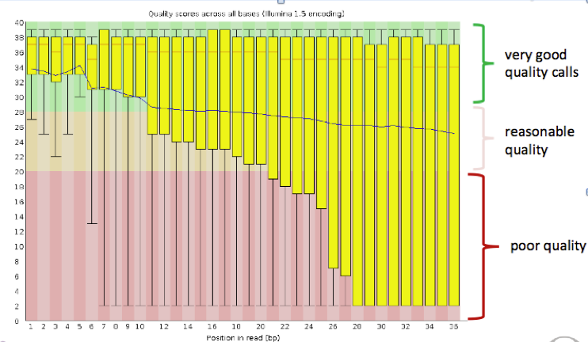

# Hands-on Somatic Variant Analysis in Galaxy and IGV

### Sheffield Bioinformatics Core


web : [sbc.shef.ac.uk](http://sbc.shef.ac.uk)  
twitter: [SheffBioinfCore](https://twitter.com/SheffBioinfCore)  
email: [bioinformatics-core@sheffield.ac.uk](bioinformatics-core@sheffield.ac.uk)

-----

# Tutorial Overview

This tutorial will cover the basics of Somatic analysis using Galaxy; a open-source web-based platform for the analysis of biological data. You should gain an appreciation of the tasks involved in a typical NGS analysis and be comfortable with the outputs generated by a sequencing service. You will also use the Integrative Genomics Viewer (IGV) to *view* the aligned reads in an interactive manner.

We will use training materials provided by the Galaxy Project and sign-post to relevant sections. If you want to find more detailed tutorials on IGV or Galaxy you can follow the links below:-

- [Galaxy Training Portal](https://training.galaxyproject.org/training-material/)
- [IGV Tutorial](https://github.com/griffithlab/rnaseq_tutorial/wiki/IGV-Tutorial)

<!--The tutorial covers the following steps in our analysis pipeline


-->

-----

## Background

#### Where do the data in this tutorial come from?

The data for this tutorial are from a cancer patient down-sampled to genes that are present in the COSMIC dataset. We will use these data throughout the course to call variants, filter and discuss the clinical impact of any mutations. 

# Preparation and Data Upload

If attending this workshop in-person you should have access to a private queue on the usegalaxy.eu server that will allow your jobs to run quicker.

Follow this link to register an account:- 

https://usegalaxy.eu/join-training/sbc-somatic-2019-05-10

Otherwise, register as a new user on one of the public Galaxy servers

- https://usegalaxy.org/
- https://usegalaxy.org.au
- https://usegalaxy.eu

**Make sure you check your email to activate your account**

## Import the data for the workshop.

We can going to import the [*fastq* files](https://en.wikipedia.org/wiki/FASTQ_format) for this experiment. This is a standard format for storing raw sequencing reads and their associated quality scores. However, as we will see, the representation of the quality scores has changed over time.

The fastq files for this workshop have been uploaded to google drive folder

- [Click here to access the google folder](https://drive.google.com/drive/folders/1-S8d92NmcQ7RfVjtP-FEtCizZnj_GTvX?usp=sharing)

Download all the files ending in `fastq.gz` and `fasta.gz` in this directory to your laptop

You can import the data by:

1.  In the tool panel located on the left, select **Get
    Data > Upload File**. 
2.  **Choose local file** and browse to the directory containing the files from the google drive and select all the file. Click **Open** to close the file browser. The names of the files should now appear in Galaxy.
3.  Click **Start** to begin the upload

3.  You should now have these 5 files in your history:

- `231335_cancer_genes_r1.fastq.gz`
- `231335_cancer_genes_r2.fastq.gz`
- `231336_cancer_genes_r1.fastq.gz`
- `231336_cancer_genes_r2.fastq.gz`
- `hg19.chr5_12_17.fasta.gz`

where the first two files represent the forward and reverse reads sequence data from a patient’s normal tissue, and the next two represent the data of the same patient’s tumor tissue. The final file is a cut-down reference genome for chromosomes 5, 12 and 17 only.


# Section 2: Fastq file format

You can view the files you just uploaded by clicking the **eye icon** the history item. The first few lines should read as follows


**231336_cancer_genes_r1.fastq.gz**

```
@ST-K00265:137:HT33CBBXX:3:1213:9952:2738/1
CGGACCCCCGACATGTCTGCTGTTGCCGCCGCGCAGTCCCGCCAGTCCCTGCGCAGACTGCGCCTGCGCACCACACCGGGGTCGAGCTGGCGGGGGAGGGG
+
-AF-A<AAA7AA-AF<F7AJAJF<AJF777FAJJFJJ7-A-7-FJAAA-AFJJ<7F7F<FJ7-A-FJA<J7J77<<FJ<JJ<<JAFJ<7FJJJJ-J-A<7A
```

**231336_cancer_genes_r2.fastq.gz**

```
@ST-K00265:137:HT33CBBXX:3:1107:2047:6378/1
CCAGCTCGACCCCGGTGTGGTGCGCAGGCGCAGTCTGCGCAGGGACTGGCGGGACTGCGCGGCGGCAACAGCAGACATGTCGGGGGTCCGGGGCCTGTCGC
+
AA<AAFJFAJ7A-A7--AFA<FJFJJ7FFJAJ7-7-7FJJJJFJ7FFJJ7FA<<F<7FJJAAJJA<JJJFFJJ<AJF<JJFJA-<7AJJA<-AF-JJJJJ-
```


The first line is the unique identifier for each sequenced read. It can be used to encode information such as the *sequencing machine*, *flow cell* and *lane* that the read was generated from and the physical coordinates on the lane.  

The quality scores are [ASCII](http://ascii-code.com/) representations of how confident we are that a particular base has been called correctly. Letters that are further along the alphabet indicate higher confidence. This is important when trying to identify types of genome variation such as single base changes, but is also indicative of the overall quality of the sequencing. Different scales have been employed over time (resulting in a different set of characters appearing in the file). . 


### Deriving the Quality Score

First of all, we convert the base-calling probability (p) into a `Q` score using the formula

- Quality scores $$ Q = -10log_{10}p$$
    + Q = 30, p=0.001
    + Q = 20, p=0.01
    + Q = 10, p=0.1
- These numeric quanties are *encoded* as [**ASCII**](http://ascii-code.com/) code
    + At least 33 to get to meaningful characters
    (https://en.wikipedia.org/wiki/FASTQ_format)
    
      

### Quality Scores to probabilities

- look-up the ASCII code for each character
- subtract the offset to get the Q score
- convert to a probability using the formula:-

$$ p = 10^{-Q/10} $$

Let's see this calculation for the first few bases of the first read in `231336_cancer_genes_r1.fastq`; `-AF-A<AAA7....`

Character  | Code | Minus 33 Offset | Probability
------------- | ------------- | ------------- | -------------
-  | 45 | 12 | 0.0631
A  | 65 | 32 | 0.0006
F  | 70 | 37 | 0.0002
-  | 45 | 12 | 0.0631
A  | 65 | 32 | 0.0006
<  | 60 | 27 | 0.0020
A  | 65 | 32 | 0.0006
A  | 65 | 32 | 0.0006

In practice, we don't have to convert the values as we have software that will do this automatically


-----

# Section 3: Quality Assessment of NGS reads

[FastQC](https://www.bioinformatics.babraham.ac.uk/projects/fastqc/) is a popular tool from [Babraham Institute Bioinformatics Group](https://www.bioinformatics.babraham.ac.uk/index.html) used for *quality assessment* of sequencing data. Most Bioinformatics pipelines will use FastQC, or similar tools in the first stage of the analysis. The [documentation](https://www.bioinformatics.babraham.ac.uk/projects/fastqc/Help/) for FastQC will help you to interpret the plots and stats produced by the tool. A traffic light system is used to alert the user's attention to possible issues. 

The most important image is whether the base quality decreases significantly over the length of the read



Good quality data should look something like:-


We will now follow the relevant section on the Galaxy training page for QC and alignment

[https://training.galaxyproject.org/training-material/topics/variant-analysis/tutorials/somatic-variants/tutorial.html#quality-control-and-mapping-of-ngs-reads](https://training.galaxyproject.org/training-material/topics/variant-analysis/tutorials/somatic-variants/tutorial.html#quality-control-and-mapping-of-ngs-reads)

# Section 4: Alignment

The result of the previous practical will be a `.bam` file that we will describe in the next section. This file is not human-readable, as it is compresed. But we can convert to a readable format for illustration purposes.

## Viewing the alignments

Click on the eye of the resulting file to view the alignments.


A *single standard* file format has emerged for aligned reads. Moreoever, this file format is consistent regardless of whether you have DNA-seq, RNA-seq, ChIP-seq... data. 

The `bam` file is a compressed, binary, version of a `sam` file.

- **S**equence **A**lignment/**M**ap (sam) 
- The output from an aligner such as `bwa`
- Same format regardless of sequencing protocol (i.e. RNA-seq, ChIP-seq, DNA-seq etc)
- May contain un-mapped reads
- Potentially large size on disk; ~100s of Gb
    + Can be manipulated with standard unix tools; e.g. *cat*, *head*, *grep*, *more*, *less*....
- Official specification can be [obtained online](http://samtools.github.io/hts-specs/SAMv1.pdf): -
- We normally work on a compressed version called a `.bam` file. See later.
- *Header* lines starting with an `@` character, followed by tab-delimited lines
    + Header gives information about the alignment and references sequences used


The first part of the header lists the names (`SN`) of the sequences (chromosomes) used in alignment, their length (`LN`) and somtimes a *md5sum* "[digital fingerprint](https://en.wikipedia.org/wiki/Md5sum)" of the `.fasta` file used for alignment (`M5`).

```
@HD VN:1.3 SO:coordinate
@SQ SN:chr5 LN:180915260
@SQ SN:chr12 LN:133851895
@SQ SN:chr17 LN:81195210
@RG ID:231335 SM:Normal PL:ILLUMINA

```


We also have a section where we can record the processing steps used to derive the file

```
@PG ID:bwa PN:bwa VN:0.7.17-r1188 CL:bwa mem -t 8 -v 1 -R @RG\tID:231335\tSM:Normal\tPL:ILLUMINA localref.fa /data/dnb02/galaxy_db/files/009/352/dataset_9352452.dat /data/dnb02/galaxy_db/files/009/352/dataset_9352453.dat

```

Next is a *tab-delimited* section that describes the alignment of each sequence in detail. 

```
ST-K00265:137:HT33CBBXX:3:2106:5944:11759	99	chr5	218378	60	101M	=	218465	188	GTATCCCCCCTCCCCCGCCAGCTCGACCCCGGTGTGGTGCGCAGGCGCAGTCTGCGCAGGGACTGGCGGGACTGCGCGGCGGCAACAGCAGACATGTCGGG	AAFFFJJJJJJJJJJJJJJJJJJJJJJJJJJJJJJJJJJJJJJJJJJJJJJJJJJJJJJJJJJJJJJJJJJJJJJJJJJJJJJJJJJJJJJJJJJJJJJJJ	NM:i:0 MD:Z:101 MC:Z:101M AS:i:101 XS:i:50 RG:Z:231335
```


Column | Official Name | Brief
------ | -------------- | -----------
1      | QNAME          | Sequence ID
2      | FLAG           | Sequence quality expressed as a bitwise flag
3      | RNAME          | Chromosome
4      | POS            | Start Position
5      | MAPQ           | Mapping Quality
6      | CIGAR          | Describes positions of matches, insertions, deletions w.r.t reference
7      | RNEXT          | Ref. name of mate / next read
8      | PNEXT          | Postion of mate / next read
9      | TLEN           | Observed Template length
10     | SEQ            | Sequence
11     | QUAL           | Base Qualities

There can also be all manner of optional tags as extra columns introduce by an aligner or downstream analysis tool. A common use is the `RG` tag which refers back to the read groups in the header.


### Sorting and indexing

You will notice from the 3rd column that the reads are ordered according to their start position; whereas the reads in the `fastq` file were arranged in order that they were generated on the flow cell. By default, `bwa-mem` produces a bam where the reads are in the same order as the `fastq`. However, this is rather incovenient for analysis where we require reads from the same location to be next to each other in the file.

An additional couple of steps have been performed after bowtie2; sorting the file according to genome position and producing an *index* file. The index file does not provide any useful information for us and cannot be viewed in Galaxy. However, we will need it later on when viewing the data in IGV. 

## Dr Mark Dunning presents....Fun with flags!

The *"flags"* in the sam file can represent useful QC information

  + Read is unmapped
  + Read is paired / unpaired
  + Read failed QC
  + Read is a PCR duplicate (see later)

The combination of any of these properties is used to derive a numeric value


For instance, a particular read has a flag of 163


### Derivation

There is a set of properties that a read can possess. If a particular property is observed, a corresponding power of 2 is added multiplied by 1. The final value is derived by summing all the powers of 2.


Flag Value | Meaning
---------- | --------------------------------
69 (= 1 + 4 + 64) 	| The read is paired, is the first read in the pair, and is unmapped.
77 (= 1 + 4 + 8 + 64) |	The read is paired, is the first read in the pair, both are unmapped.
83 (= 1 + 2 + 16 + 64) |	The read is paired, mapped in a proper pair, is the first read in the pair, and it is mapped to the reverse strand.
99 (= 1 + 2 + 32 + 64) |	The read is paired, mapped in a proper pair, is the first read in the pair, and its mate is mapped to the reverse strand.
133 (= 1 + 4 + 128) |	The read is paired, is the second read in the pair, and it is unmapped.
137 (= 1 + 8 + 128)  |	The read is paired, is the second read in the pair, and it is mapped while its mate is not.
141 (= 1 + 4 + 8 + 128) |	The read is paired, is the second read in the pair, but both are unmapped.
147 (= 1 + 2 + 16 + 128) |	The read is paired, mapped in a proper pair, is the second read in the pair, and mapped to the reverse strand.
163 (= 1 + 2 + 32 + 128) |	The read is paired, mapped in a proper pair, is the second read in the pair, and its mate is mapped to the reverse strand.


See also

- https://broadinstitute.github.io/picard/explain-flags.html

## Have a CIGAR!


The ***CIGAR*** (**C**ompact **I**diosyncratic **G**apped **Alignment** **R**eport) string is a way of encoding the match between a given sequence and the position it has been assigned in the genome. It is comprised by a series of letters and numbers to indicate how many consecutive bases have that mapping.


 
 Code  | Description
------------- | -------------
M  | alignment match
I  | insertion
D  | deletion
N  | skipped
S  | soft-clipping
H  | hard-clipping


e.g.

- `68M`
    + 68 bases matching the reference
- `1S67M`
    + 1 soft-clipped read followed by 67 matches
- `15M87N70M90N16M`
    + 15 matches following by 87 bases skipped followed by 70 matches etc.


## Checking the alignment stats

We will now generate a few basic statistics about the alignment of our data

1. Select the tool *NGS: SAMtools -> Flagstat* 
2. In the *BAM File to Convert* box choose the bam file produced by bwa-mem.


The tool will also report how many ***PCR Duplicates*** have been found in the data. But as we haven't yet run any software to identify such reads, the flagstat output will show 0 reads.

1. Find the tool *SAMtools -> Idxstats*
2. In the *BAM file* dropdown select the bam file produced by bowtie2

The output of this tool will tell you how many reads aligned to each chromosome in your reference genome.

<div class="alert alert-warning">

**Optional Exercise:** The multiqc tool that we introduced earlier is about to interpet the output of flagstat and idxstats. Create a report the combines the results of these metrics with the fastqc reports on the fastq files

</div>


## Download your bam file

For the next setp you will need to download the `bam` file. To do this, you can click the floppy disk icon.


**Make sure that you click both Download dataset and Download bam_index**

**If you have problems creating the bam file, a pre-prepared file is available from the google drive**

https://drive.google.com/drive/folders/1-S8d92NmcQ7RfVjtP-FEtCizZnj_GTvX?usp=sharing

# Section 5. Visualising the aligned reads with IGV

Whilst Bioinformatics tools are very powerful and allow you to perform statistical analyses and test hypotheses, there is no substitute for **looking at and exploring the data**. A trained-eye can quite quickly get a sense of the data quality before any computational analyses have been run. Futhermore, as the person requesting the sequencing, you probably know a lot about the biological context of the samples and what to expect.

We will load the aligned reads that we have just created into IGV and start to get a feel for the process of variant calling

1. Download IGV

You can download IGV for Windows using this link 

- https://software.broadinstitute.org/software/igv/download

*Extract* the zip file that you have downloaded


Double-Click the file `igv` to launch IGV


2. Load a reference Genome and some Data Tracks

By default, IGV should load with Human genome version *hg19* already loaded. It is essential that you use the **same genome version** that the reads were aligned to. You can check / change the genome by clicking the drop-down menu in the upper-left


We can also load extra *tracks* into the browser that can help us understand our variant calls. For example, we can load data from *dbSNP* which will tell us about common mutations that already been identified. These can be loaded via *File* -> *Load from Server..* and selecting `dbSNP 1.4.7` from the `Variation and Repeats` section


3. Navigate around IGV

When IGV loads up we start with a very high-level view of the genome where *all* chromosomes are visible. Such a view might be useful if we were interested in large copy-number variation across a cohort of samples. However, we are mostly interested in changes at the individual base-level which is not possible to view at this resolution. We need to navigate to a particular region of interest.

Alongside the drop-down menu used to change the genome, there is a drop-down menu to select a particular chromosome and a box where we can enter text. Inside the text box we can enter a particular genome interval of interest

e.g. `chr1:10,000-11,000`


IGV should now be displaying a region on chromosome 1 from base position `10,000` to `11,000`. 


At this resolution, we can start to see the *genome sequence*. Each DNA base is represented by a different colour (A = green, C = blue) and it seems that this region is highly-repetitive; comprising mostly `C` bases. We can zoom fruther in using the zoom control in the top right of IGV


We can use the zoom control, and also move along the genome by holding down by mouse button and sliding left-and-right, to navigate to whatever genomic location we want. If we known the name of the gene we want to interrogate we can navigate directly there using the text box


The text box should now update to show the coordinates of `BRCA1` (`chr17:....`). At the bottom of the screen we can now see the *gene model* for the gene `BRCA1`.  Genes are represented as lines and boxes. Lines represent intronic regions and boxes represent exonic regions. The arrows indicate the direction / strand of transcription for the gene.


4. Load the aligned reads

Choose File > Load from File..., select the bam file that you downloaded from Galaxy, and click OK. Note that the bam and index files must be in the same directory for IGV to load these properly.


The main display of IGV should now update to hold tracks for the aligned reads from this bam file. It may seem like nothing is being displayed. This is because we are zoomed-out too far to be able to see the reads. **Use the zoom function and move along the genome until you get to the first exon of BRCA1**. After you have zoomed-in far enough you will start to see some grey rectangles. *These are the aligned reads*.


If you hover over a particular read, how will see columns from the bam file being displayed such as the mapping quality and information about the paired reads.


<div class="alert alert-warning">

**Discussion:** 

Later on we will have some more examples of inspecting variants, but for now let's familiarise ourselves with IGV and what the data look like

- Navigate to region `chr17:41,244,228-41,245,700` in IGV. How many potential SNVs can you find inside the region? How many of these are likely to be *somatic*.

- Navigate to position `chr17:41,219,513` in IGV. Hover over the coverage track and discover the percentage of reference bases in the Tumour and the Normal. Is there evidence for a somatic variant at this position? 


</div>

# Section 6: Post-processing of reads and Variant Calling

Whilst we can inspect variants by eye, it would clearly be impossible to scrutinise each position in the genome to see if a variants exists there. We will employ a *variant calling* method to narrow-down our search for somatic variants, although as we will see, such calls still require some degree of filtering and curation. The particular tool we will use is [varscan2](http://dkoboldt.github.io/varscan/), mainly because it is available via Galaxy. For production-level analyses a tool such as [MuTect](https://software.broadinstitute.org/cancer/cga/mutect) could be considered. However, there are licensing issues which preclude MuTect from being available in Galaxy. 

Before we can proceed to variant calling, there are a couple of post-processing tasks that should be performed; removing duplicates and indel re-alignment. 

In brief, removing *duplicates* removes reads that have **exactly the same** start and end position. Such reads are *assumed* to be an artefact of the PCR process and give a false impression of the coverage at affected positions. *However, careful thinking is required in situations other than whole-genome sequencing and this should certainly never be applied for targeted sequencing*.


Indel re-alignment deals with an artefact that can occur when placing reads close to indels. Since each read is aligned separately, alignment tools may prefer to align a read with a reference mismatch rather than consider an indel within a read. However, taking all reads into consideration around a locus may reveal the presence of an indel and prevent SNVs being falsely identified.

*Before realignment*


*After realignment*


(see this [video](https://www.youtube.com/watch?v=S-WkQ5n0LLQ) for an explanation)

Now follow the steps in ["Mapped Reads postprocessing"](https://training.galaxyproject.org/training-material/topics/variant-analysis/tutorials/somatic-variants/tutorial.html#mapped-reads-postprocessing) from the galaxy training page, before proceeding to ["Variant calling and classification"](https://training.galaxyproject.org/training-material/topics/variant-analysis/tutorials/somatic-variants/tutorial.html#variant-annotation-and-reporting)


# Section 7: Annotation

## About vcf format


In the previous section, you will have produced a *vcf* file. The `.vcf` format was initially developed by the [1000 Genomes Project](http://www.1000genomes.org/wiki/Analysis/vcf4.0), and ownership has been subsequently transferred to [Global Alliance for Genomics and Health Data Working group file format team](http://ga4gh.org/#/fileformats-team). The format can be used to represent information about all kinds of genomic variation. In this session we will just consider SNVs.

We don’t require any specialised software to look at the contents of a vcf file. They can be opened in a bog-standard text editor, however your laptop may try and interpret the file as containing contact information (virtual contact file).

In a similar vein to the `.bam` and `.sam` files we saw earlier, the `.vcf` files contains many lines of header information. These describe the reference sequences and various filters that have been applied.


```
##fileformat=VCFv4.2
##FILTER=<ID=PASS,Description="All filters passed">
##reference=ref.fa
##contig=<ID=chr5,length=180915260>
##contig=<ID=chr12,length=133851895>
##contig=<ID=chr17,length=81195210>
##FILTER=<ID=VarCount,Description="Fewer than 4 variant-supporting reads">
##FILTER=<ID=VarFreq,Description="Variant allele frequency below 0.05">
##FILTER=<ID=VarAvgRL,Description="Average clipped length of variant-supporting reads < 90">
......
......

```

After many more lines of information, we finally get to the details of the actual calls themsevles. This part of the file is tab-delimited; with 10 columns for every call. The vcf specification page gives details of what should be contained in each column


Shown here is the information about three calls

```
#CHROM	POS	ID	REF	ALT	QUAL	FILTER	INFO	FORMAT	NORMAL	TUMOR
chr5	225768	.	G	C	.	VarReadPos	DP=27;SS=1;SSC=0;GPV=5.1363e-16;SPV=1	GT:GQ:DP:AD:ADF:ADR	1/1:.:16:0,16:0,2:0,14	1/1:.:11:0,11:0,1:0,10
chr5	230980	.	A	G	.	PASS	DP=157;SS=1;SSC=0;GPV=0;SPV=1	GT:GQ:DP:AD:ADF:ADR	1/1:.:88:0,88:0,51:0,37	1/1:.:69:0,69:0,45:0,24
chr5	231111	.	T	C	.	PASS	DP=127;SS=1;SSC=0;GPV=0;SPV=1	GT:GQ:DP:AD:ADF:ADR	1/1:.:75:0,75:0,39:0,36	1/1:.:52:0,52:0,26:0,26
```

The first seven columns should look consistent across different genotype callers. The contents of the `INFO` and `FORMAT` columns will depend on what variant caller has been used. The `INFO` column contains metrics and other information related to each variant call as a set of `KEY=VALUE` pairs. Each pair is separated by a `;` character.

The INFO for the a variant call may read as:-

```
DP=27;SS=1;SSC=0;GPV=5.1363e-16;SPV=1
```

or 

```
      Key   Value
DP=27 DP    27
SS=1  SS    1
SSC=0 SSC   0
GPV=5.1.. GPV   5.1363e-16
SPV=1 SPV   1

```

The meaning of each key can be discovered by looking at the header for the file. e.g. `##FORMAT=<ID=DP,Number=1,Type=Integer,Description="Read depth">`. So this variant has a total of 27 bases covering it. 


The final two columns in the file describes the calls for the NORMAL and TUMOUR samples respectively. In the sample column (`NORMAL`) for the first variant we see the entry

```
1/1:.:16:0,16:0,2:0,14
```

These are values separated by a `:` character and they are interpreted in the same order as dictated by the FORMAT column; which is `GT:GQ:DP:AD:ADF:ADR`

```
##FORMAT=<ID=GT,Number=1,Type=String,Description=Genotype>
##FORMAT=<ID=GQ,Number=1,Type=Integer,Description="Genotype quality">
##FORMAT=<ID=DP,Number=1,Type=Integer,Description="Read depth">
##FORMAT=<ID=AD,Number=R,Type=Integer,Description="Read depth for each allele">
##FORMAT=<ID=ADF,Number=R,Type=Integer,Description="Read depth for each allele on the forward strand">
##FORMAT=<ID=ADR,Number=R,Type=Integer,Description="Read depth for each allele on the reverse strand">
```

So for this particular variant there is a genotype of `1\1` (Homozygous for the alternate allele) in the normal sample and a depth of `16` etc. The same genotype information is repeated for the tumour. From this we can infer whether the variant is likely to be somatic or not and gain insight into whether it is a true variant or a false positive (which we will discuss in detail later).


<div class="alert alert-warning">

**Discussion:** Locate the lines in the vcf file that relate to some of the positions that we looked at previously in IGV. How many reads in total cover each position?

- `chr17:41244936`
- `chr17:41219513`
- `chr17:41234304`

What kind of variants (Germline, Somatic) have been called at these positions? 

You can also load the vcf into IGV, which will display details of each variant call above the aligned reads.


</div>


## Annotating with SNPeff

As we have seen the standard vcf file contains genome coordinates for each variant, but gives no useful information about what gene (if any) the variant lies within or the potential impact of the variant. One such tool for adding genomic information is SNPeff which is described in the Galaxy tutorial.

- [See here](https://training.galaxyproject.org/training-material/topics/variant-analysis/tutorials/somatic-variants/tutorial.html#adding-annotations-to-the-called-variants); **"Adding functional genomic annotations" only**

SNPeff will produce a modified `vcf` file and a HTML report. 

<div class="alert alert-warning">

**Discussion:** Scroll through the contents of the vcf file produced by snpeff. What extra information has it added? Try and locate the variants within `BRCA1`. Also take some time to digest the contents of the HTML report and the information it provides

</div>


## Annotation with Ensembl VEP

A useful alternative to running SNPeff within Galaxy is the online VEP tool provided by Ensembl. This will annotate our variants with gene identifiers and also provide some predictions about the impact of the variant. 

More documentation on Ensembl VEP is [available online](http://grch37.ensembl.org/info/docs/tools/vep/online/index.html)

Command line tools are available, but we will use the online interface; making sure that we access the version of VEP with the correct genome version. Going straight to the Ensembl VEP website will mean using a later genome build.

The **hg19** version of VEP can be accessed [here](http://grch37.ensembl.org/Homo_sapiens/Tools/VEP). A set of coordinates can be entered into the text box, or a VCF file can be uploaded.


<div class="alert alert-warning">
Upload the `vcf` file that you annotated with SNPeff. If you were unable to complete this step, a copy is available in the google drive; `231335_231336_VarScan_Variants_SnpEff_SS2.vcf`.
</div>

You will have a choice about what transcript database to use. The output can also be configured by clicking the *+* symbol next to a particular section. e.g. *Variants and frequency data*. After selecting the options you want, scroll down to the bottom of the page and click **Run**. The screen should now change to let you know that VEP is running.


The screen will refresh by itself, and eventually a green *Done* box should appear. At which point you will be able to inspect the results


The results can be inspected online, or downloaded. Downloading as a text file is better for browsing in Excel, and can also be manipulated in languages such as R.

## Assessment of Somatic calls

[Click here](somatic_snv_assessment_exercise.html) to follow an exercise on inspecting and evaluating somatic calls
